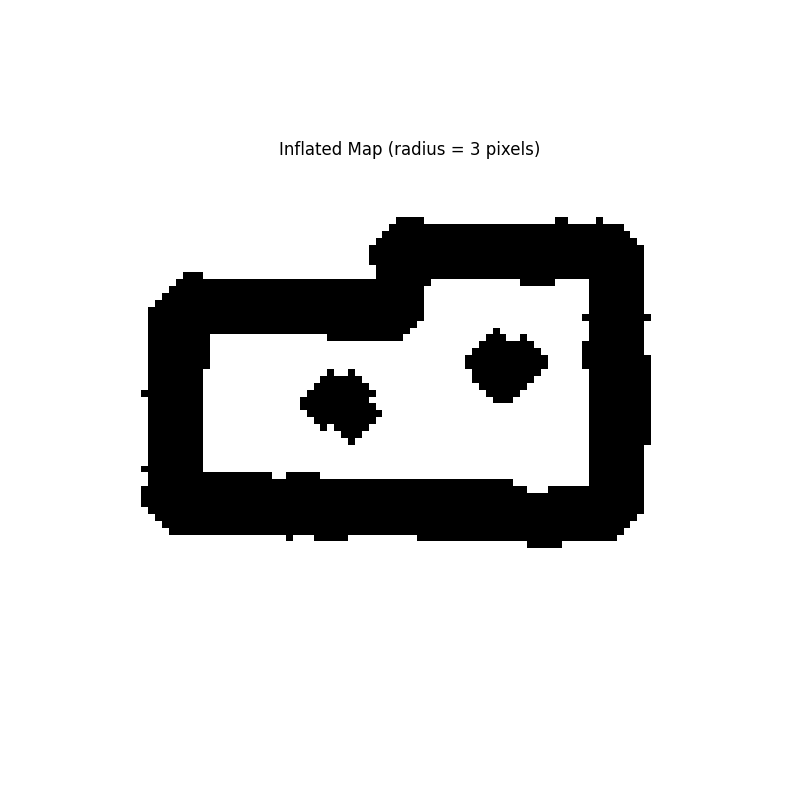
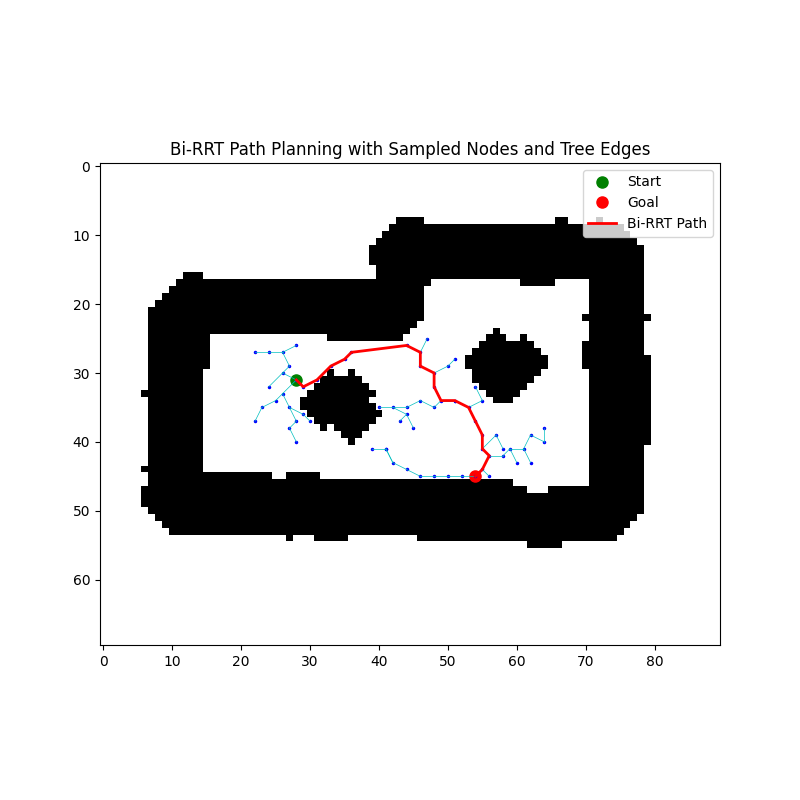

# BiRRT Map Navigator

A modular Bi-directional RRT (Bi-RRT) path planning pipeline built on a Slam map generated by manually navigating a TurtleBot in a simulated world environment. This project demonstrates robust sampling, obstacle inflation, and tree-based pathfinding for mobile robot navigation.

---

## Project Overview

This planner operates on a map created interactively using keyboard controls (WASDX), simulating manual exploration. The saved map is then processed for obstacle inflation and used for Bi-RRT path planning.

Key features:
- Custom map loading from `.pgm` and `.yaml`
- Obstacle inflation based on robot radius
- Sampling with buffer zones and min-distance constraints
- Bi-RRT planner with tree growth and connection logic
- Full visualization of sampled nodes, tree edges, and final path

---

## Folder Structure
<pre>
birrt-map-navigator/
├── birrt.py                  # Main runner script
├── planner/                  # Modular planner package
│   ├── __init__.py           # Initializes the planner package
│   ├── map_utils.py          # Map loading, inflation, coordinate conversions
│   ├── sampling.py           # Sampling logic
│   ├── collision.py          # Collision checking
│   ├── birrt_planner.py      # Bi-RRT algorithm
│   ├── visualization.py      # Visualization of nodes, trees, and path
├── map2.pgm                  # Custom map image
├── map2.yaml                 # Map metadata

</pre>
---

## Getting Started

### 1. Install dependencies

```bash
pip install -r requirements.txt
```
###2. Run the planner

```bash
python3 birrt.py
```

## Demo Outputs

### Original Map


### Inflated Map


### Path Overlaid on Map

